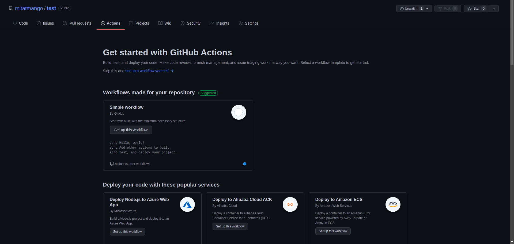
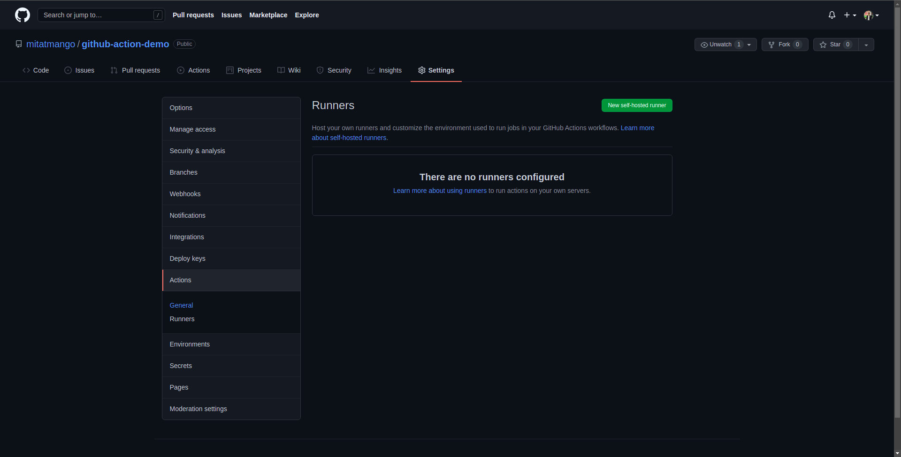
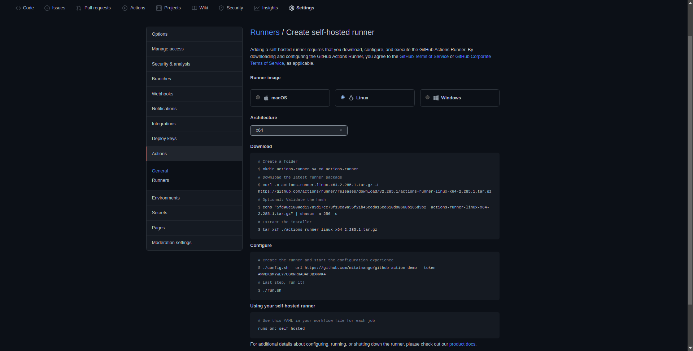

# GitHub Actions

## Enable GitHub actions

By default GitHub actions are enabled on any new repo. You can create and access those in *Action* tab on your repo page.

## Adding a self-hosted runner

### Prerequisites 
* SSH connection to the server should be established before hand
* Runner username should ideally not have root access for safety purposes

### Follow these steps to add a self-hosted runner in you repo

1. Go to settings page of the repository.
2. Under **Actions** tab click on **Runner** option

3. Click on **New self-hosted runner**

