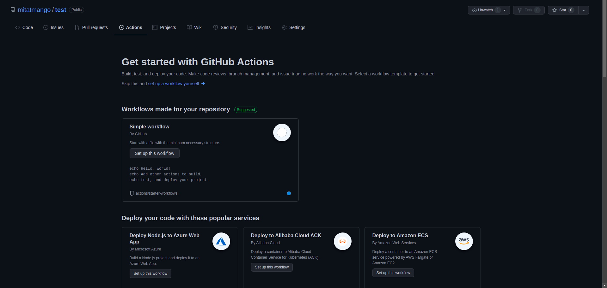

# GitHub Actions

## Enable GitHub Actions

By default GitHub actions are enabled on any new repo. You can create and access those in *Action* tab on your repo page.



## Adding a Self-hosted Runner

### Prerequisites 
* SSH connection to the server should be established before hand
* Runner username should ideally not have root access for safety purposes


### Follow these steps to add a self-hosted runner in you repo

1. Go to settings page of the repository.
2. In the left sidebar, click `Actions`.
3. In the left sidebar, under "Actions", click `Runners`.

    

4. Click on `New self-hosted runner`

    

5. Select the operating system image and architecture of your self-hosted runner machine.
6. You will see instructions showing you how to download the runner application and install it on your self-hosted runner machine.

### Installing the service

1. Stop the self-hosted runner application if it is currently running.
2. Install the service with the following command: 
    ```
    sudo ./svc.sh install
    ```
3. Start the service with the following command:
    ```
    sudo ./svc.sh start
    ```

## NPM Build Action

This action will build webpack packages and push directly onto the `development` branch. These packages include:
* react-app
* es6-webpack
* new-react-app
* ckeditor-webpack

### Steps for setting up the GitHub action

1. Go to `Action` tab in repository and add a Node.js workflow

    

2. It will generate a `.github/workflows/node.js.yml` file

    

3. Modify the file like mentioned below:
    ```
    # react-build.yml

    name: React App Build

    on:
        pull_request:
            types: [closed]
            branches: [development]
            paths:
            - public/react-app/**
            # Changes of these files will trigger the workflow

    jobs:
        build:
            runs-on: self-hosted
            if: github.event.pull_request.merged == true
            env:
                CI: false

            steps:
              - uses: actions/checkout@v2

              - name: Use Node.js 12.x
                uses: actions/setup-node@v1
                with:
                    node-version: 12.x
                    cache: 'npm'

              - name: Install dependencies
                run: npm install
                working-directory: public/react-app

              - name: Build
                run: npm run build:production
                working-directory: public/react-app

              - name: Add & Commit
                uses: EndBug/add-and-commit@v7.5.0
                with:
                    # The arguments for the `git add` command (see the paragraph below for more info)
                    # Default: '.'
                    add: 'public/react-app/build'

                    # Determines the way the action fills missing author name and email. Three options are available:
                    # - github_actor -> UserName <UserName@users.noreply.github.com>
                    # - user_info -> Your Display Name <your-actual@email.com>
                    # - github_actions -> github-actions <email associated with the github logo>
                    # Default: github_actor
                    default_author: github_actor

                    # The message for the commit.
                    # Default: 'Commit from GitHub Actions (name of the workflow)'
                    message: 'React Build'

                    # The name of the branch to use, if different from the one that triggered the workflow.
                    # Default: the branch that triggered the run
                    branch: development
        qa-push:
            runs-on: self-hosted
            needs: [build]
            steps:
              - name: Invoke deployment
                uses: wei/curl@master
                with:
                  args: http://link-to-deployment-server.com

    ```

4. Above mentioned will build `react-app` and commit the build on `development` branch
5. This process can be repeated for all the npm apps in the project with separate workflow files

### Action References:
* Checkout: https://github.com/marketplace/actions/checkout
* Node Setup: https://github.com/marketplace/actions/setup-node-js-environment
* Add & Commit: https://github.com/marketplace/actions/add-commit
* cUrl: https://github.com/marketplace/actions/github-action-for-curl

## Delete Stale Branches Action

This action periodically scans for branches that are older that configured number of days and deletes them.

### Steps for setting up the GitHub action

1. Add a new file `.github/workflows/delete-stale-branches.yml` in repository
2. Modify the file like mentioned below:
   ```  
    name: Delete Stale Branches

    on:
    # Run daily at midnight on 5th of every month
    schedule:
        - cron: "0 0 5 * *"

    # Allow workflow to be manually run from the GitHub UI
    workflow_dispatch:

    jobs:
        cleanup_old_branches:
            runs-on: self-hosted
            name: Clean up repo
            steps:
            - name: Delete dead branches
                uses: phpdocker-io/github-actions-delete-abandoned-branches@v1
                id: delete_branches
                with:
                github_token: ${{ secrets.GITHUB_TOKEN }}
                last_commit_age_days: 120
                ignore_branches: 'development,production,staging'

                # Disable dry run and actually get stuff deleted
                dry_run: no

            - name: Get output
                run: "echo 'Deleted branches: ${{ steps.delete_branches.outputs.deleted_branches }}'"
   ```
3. Above mentioned workflow should delete the branches that are older than 120 days at every 5th date of the month at mid-night according to UTC time

### Action References:
* Delete abandoned branches: https://github.com/marketplace/actions/delete-abandoned-branches
