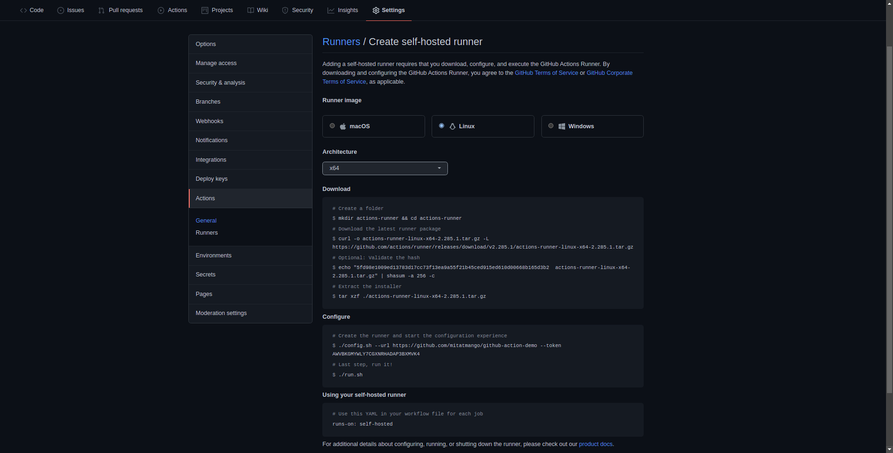

# GitHub Actions

## Enable GitHub actions

By default GitHub actions are enabled on any new repo. You can create and access those in *Action* tab on your repo page.


## Adding a self-hosted runner

### Prerequisites 
* SSH connection to the server should be established before hand
* Runner username should ideally not have root access for safety purposes


### Follow these steps to add a self-hosted runner in you repo

1. Go to settings page of the repository.
2. In the left sidebar, click **Actions**.
3. In the left sidebar, under "Actions", click **Runners**.


3. Click on **New self-hosted runner**



4. Select the operating system image and architecture of your self-hosted runner machine.
5. You will see instructions showing you how to download the runner application and install it on your self-hosted runner machine.

### Installing the service

1. Stop the self-hosted runner application if it is currently running.
2. Install the service with the following command: 
```
sudo ./svc.sh install
```
3. Start the service with the following command:
```
sudo ./svc.sh start
```